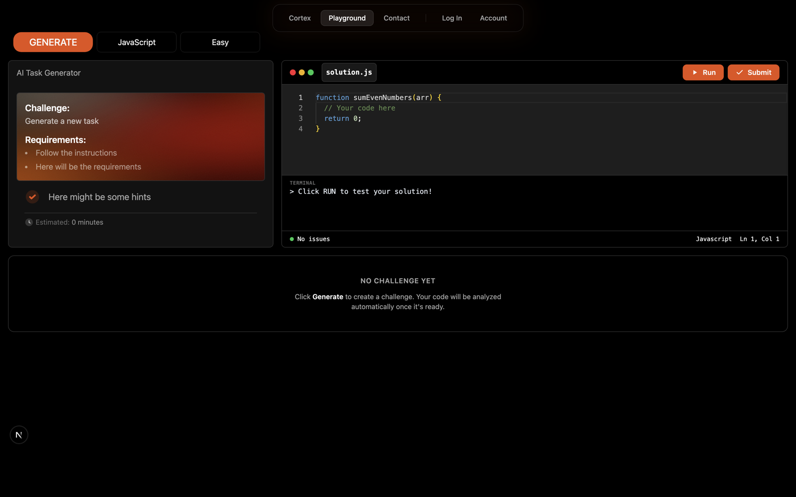
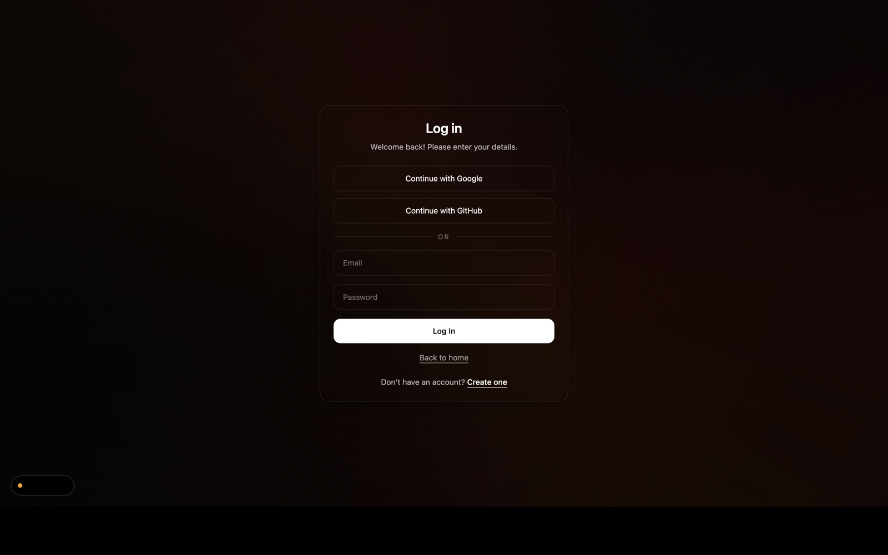
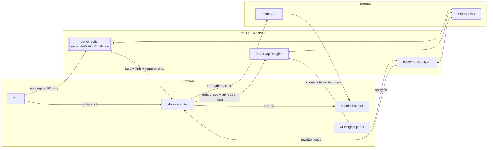

<div align="center">

# Cortex

**Deliberate AI practice for developers — missions, a live editor, and honest feedback in one loop.**

<br />

<a href="#"></a>
<a href="#"></a>
<a href="#"></a>
<a href="#"></a>
<a href="#"></a>
<a href="#"></a>
<a href="#"></a>
<a href="#"></a>

<br />
<br />

<p>Cortex turns vague learning goals into focused coding missions, instant feedback, and visible progress you can actually feel week&nbsp;after&nbsp;week.</p>

<p>
  <a href="#the-loop">The loop</a>
  &nbsp;·&nbsp;
  <a href="#features">Features</a>
  &nbsp;·&nbsp;
  <a href="#architecture">Architecture</a>
  &nbsp;·&nbsp;
  <a href="#getting-started">Getting started</a>
  &nbsp;·&nbsp;
  <a href="#design-system">Design system</a>
</p>

</div>

---

## The loop

<div align="center">
  
</div>

<br />

<table>
<tr>
<td width="33%" valign="top">

### 01 — Pick your lane

Choose a **language** (JavaScript, Python, Rust) and a **difficulty**. Cortex generates a unique mission with a task, 2–4 requirements, 3 hints, and a time estimate.

</td>
<td width="33%" valign="top">

### 02 — Build with feedback

Write code in a full **Monaco editor**, run it live, and watch the **AI Insights** panel score your code on *quality*, *performance*, and *best&nbsp;practices* — with targeted, typed feedback.

</td>
<td width="33%" valign="top">

### 03 — Apply & repeat

One-click **Apply Fix** rewrites your code using the model's overall suggestion, without wiping your intent. Iterate until the rubric rewards you.

</td>
</tr>
</table>

---

## Features

| | |
|---|---|
| **Adaptive missions** | OpenAI-generated coding tasks, seeded for uniqueness, with JSON-mode output enforced server-side. |
| **Real editor flow** | Monaco editor with language-aware starter code, live execution, and syntax highlighting. |
| **Live code execution** | JavaScript runs in-browser in a sandboxed `new Function` with a captured `console`; Python & Rust are piped through the **Piston** API. |
| **AI-driven insights** | A secondary OpenAI call reviews the code against a strict 0–100 rubric, returning per-axis scores, summaries, and typed feedback (*issue*, *improvement*, *praise*). |
| **Apply Fix** | One-click rewrite endpoint that takes the selected suggestion and returns cleaned, fence-stripped code — with client-side abort controllers so the user is always in charge. |
| **Debounced analysis** | Code is hashed (SHA-256) before each request, so the model only re-analyses when your code *actually* changes — saving latency and tokens. |
| **Route-grouped app** | Clean Next.js App Router structure: `(marketing)`, `(auth)`, `(platform)` — each with its own layout and chrome. |
| **Customisable settings** | Profile, AI preferences, billing, and privacy sections, all share a cohesive layout and design tokens. |

---

## Getting in

<div align="center">
  
</div>

Auth lives in its own route group (`(auth)`) with a dedicated layout and server actions. Users can continue with **Google**, **GitHub**, or classic **email + password** — whichever path they pick, they land straight in the platform shell with the floating glass nav ready to go.

---

## Architecture



**Key design decisions**

- **JSON-mode everywhere.** Every OpenAI call uses `response_format: { type: "json_object" }`, and every response is parsed through a hardened `safeJsonParse` + normaliser before it ever touches the UI.
- **Score clamping.** The insights rubric is enforced twice — once in the system prompt (with explicit 0–9 / 10–29 / … bands) and again in TypeScript via `clampScore()`, so the UI never sees malformed numbers.
- **Abort controllers.** Both the insights and apply-fix flows cancel in-flight requests when the user types or switches context — no stale results ever land in the editor.

---

## Project structure

```
cortex/
├─ .github/assets/            ← README screenshots
├─ public/                    ← static assets
└─ src/
   ├─ app/
   │  ├─ (marketing)/         ← landing, pricing, about, privacy
   │  ├─ (auth)/              ← login, register, server actions
   │  ├─ (platform)/          ← dashboard, playground, settings
   │  ├─ api/
   │  │  ├─ insights/         ← POST — AI code review
   │  │  └─ apply-fix/        ← POST — AI code rewrite
   │  ├─ globals.css          ← theme tokens + cortex-heat/aura/abyss backdrops
   │  ├─ layout.tsx
   │  └─ page.tsx
   ├─ components/
   │  ├─ auth/                ← LoginForm, RegisterForm, AuthCard, SocialAuth
   │  ├─ marketing/           ← MarketingHomePage, MarketingShell
   │  ├─ platform/
   │  │  ├─ editor/           ← CodeEditor, CodeWindow, InsightPanel, …
   │  │  ├─ navigation/       ← floating glass Header
   │  │  └─ settings/         ← Profile, AI, Billing, Privacy sections
   │  └─ ui/                  ← GlowButton, AnalyticsCard, CortexLoader, …
   ├─ hooks/                  ← use-toast, use-modal-store, useTypewriter
   ├─ lib/
   │  ├─ ai-client.ts         ← OpenAI SDK instance
   │  ├─ auth.ts              ← auth redirect helpers
   │  └─ code-executor.ts     ← JS sandbox + Piston bridge
   └─ types/
```

---

## Getting started

**Prerequisites** — Node 20+ and an OpenAI API key.

```bash
git clone https://github.com/<you>/cortex.git
cd cortex
npm install
```

Create a `.env.local`:

```bash
OPENAI_API_KEY=sk-...
# optional — defaults to gpt-4o-mini
OPENAI_MODEL=gpt-4o-mini
```

Run the dev server:

```bash
npm run dev
```

Then open [http://localhost:3000](http://localhost:3000). The marketing page lives at `/`, the playground at `/playground`, and settings at `/settings`.

### Scripts

| Command | What it does |
|---|---|
| `npm run dev` | Starts the Next.js dev server with Turbopack. |
| `npm run build` | Production build. |
| `npm run start` | Serves the production build. |
| `npm run lint` | Runs ESLint with `eslint-config-next`. |

---

## Design system

Cortex ships with a fully tokenised, dark-first theme called **Cortex Industrial**.

| Token | Value | Used for |
|---|---|---|
| `--background` | `#000000` | Full-screen background |
| `--card` | `#121212` | Sidebar, terminal, editor surfaces |
| `--border` | `#333333` | Panel dividers, input outlines |
| `--primary` | `#E85002` | Generate / Run / Submit CTAs |
| `--ai-core` | `#F16001` | Real-time feedback score text |
| `--ai-glow` | `#C10801` | Danger-zone borders, connection errors |
| `--text` | `#F9F9F9` | Editor text and H1 titles |
| `--muted` | `#646464` | Line numbers, terminal `>` prompt |

Three custom backdrop utilities ship alongside the palette:

- **`.bg-cortex-heat`** — drifting orange/red radial glows with a noise overlay.
- **`.bg-cortex-aura`** — fixed, slow-rotating conic gradient masked to a soft ellipse.
- **`.bg-cortex-abyss`** — the deep, centre-vignetted backdrop used behind the platform UI.

---

## Tech stack

<table>
<tr>
<td valign="top" width="50%">

**Framework & language**

- Next.js 16 (App Router, server actions)
- React 19
- TypeScript 5

**UI & styling**

- Tailwind CSS 4
- Framer Motion 12
- lucide-react
- Custom SVG animation primitives

</td>
<td valign="top" width="50%">

**State & editor**

- Zustand 5
- `@monaco-editor/react`

**AI & execution**

- `openai` SDK (chat completions, JSON mode)
- In-browser JS sandbox (`new Function` + captured console)
- Piston public API for Python & Rust

</td>
</tr>
</table>

---

<div align="center">

Built by <a href="https://github.com/"><strong>Illia Tarasovskyi</strong></a>.
<br/>
Cortex is a work in progress — feedback, ideas, and pull requests are very welcome.

<br/>

<sub>Made with too much coffee and a suspicious amount of orange.</sub>

</div>
